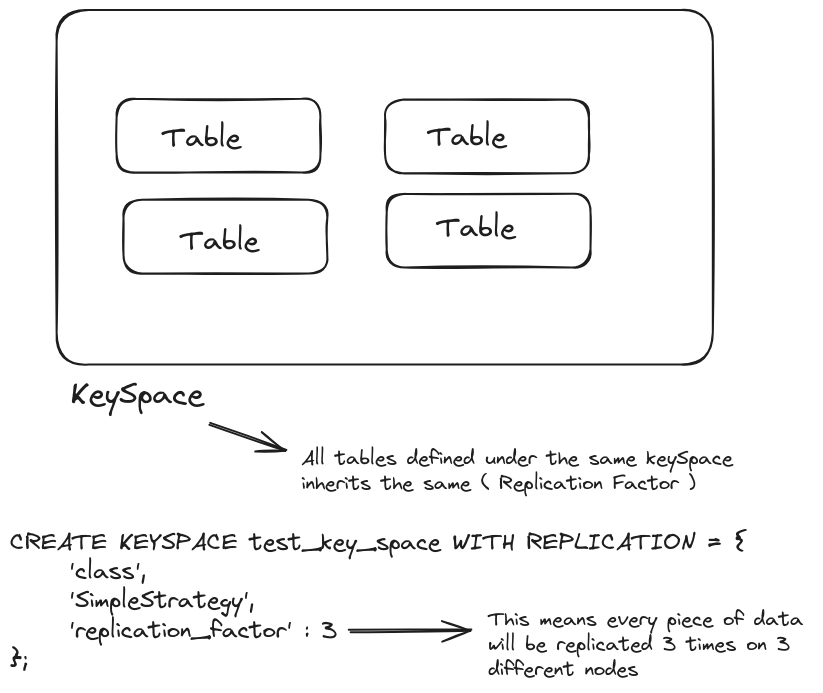

# scyllaDB
just leanring new distirbuted databsae which is scyllaDB

# Essentials 
- Designed for high-throughput and low latency
- Higher than other dbs by 10x 
- handle 1 Million Reads/Writes operations per node per second (so we can do some parallelization to get more performance i think)
- ScyllaDB is very good for high performance applications (< 10ms latency and highly throughput)

### What scyllaDB's choise at the CAP ? 
- SchyllaDB prefers the `Availability` and `Network partitioning` over `Consistency`

### What NoSql type we can classify ScyllaDB as ? 
- ScyllaDB is a `Wide Column` store database (not just document store database)

### Is ScyllaDB follows the leader-follower architecture ? 

### Consistent Hashing in ScyllaDB : 
- To be able to find which node contains ur data, ScyllaDB uses a consistent hashing (partitioner) mechanism

 
### Replication Facotr in ScyllaDB:

### Consistency levels at ScyllaDB ? 
- `CL` is how many nodes must respond on the write operations to ACK  the operation
- `CL = 1` means only one node
- `CL = QUORUM` means the majority of the nodes
- `CL = ALL` means all nodes
- we can configure this per operation (tuning per operation)

For the following example, the CL is set to QUORUM, so for a RF = 3, so each partition is replicated 3 times, so every write operation required 2 out of 3 nodes to be ACKed

